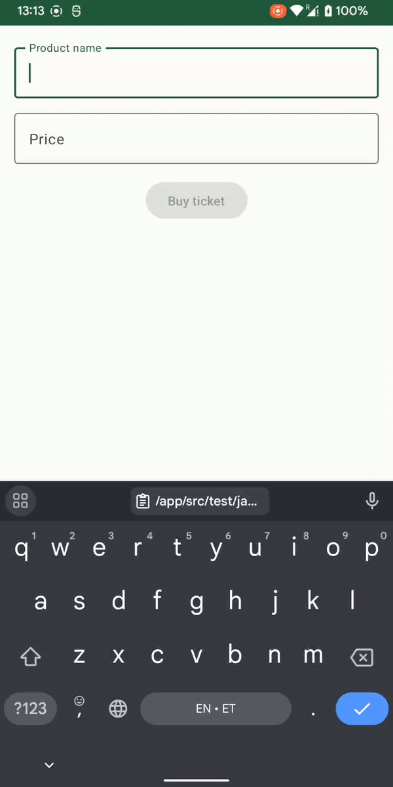

# Tickets App

Simple app for buying tickets, communicates with server using Protocol buffers.

Minimum supported OS version is Android 6.0, API level 23

## App demo

## Tech stack

- [Kotlin](https://kotlinlang.org/)
- [Kotlin Coroutines](https://developer.android.com/kotlin/coroutines) + [Flow](https://developer.android.com/kotlin/flow)
- [Jetpack Compose](https://developer.android.com/jetpack/compose)
- Jetpack View Model
- [Dagger Hilt](https://dagger.dev/hilt/)
- Clean Architecture
- [Protocol Buffers](https://developers.google.com/protocol-buffers/)
- [MockWebServer](https://github.com/square/okhttp/tree/master/mockwebserver) 
- Unit tests
- [Github Actions](.github/workflows/main.yml) as CI tool for running tests on each commit 

## Implementation details

### Proto syntax version

I use the most recent protocol buffers syntax version `proto3`, 
because of that `required` keyword has been removed from [ticket.proto](/app/src/main/proto/ticket.proto).

### Unit Tests

There are unit tests for business logic, data, and presentation layers:

- [CreateTicketUseCaseTest](/app/src/test/java/dev/l3m4rk/ridango/tickets/domain/CreateTicketUseCaseTest.kt)
- [SanitizePriceInputUseCaseTest](/app/src/test/java/dev/l3m4rk/ridango/tickets/domain/SanitizePriceInputUseCaseTest.kt)
- [ValidateTicketInputUseCaseTest](/app/src/test/java/dev/l3m4rk/ridango/tickets/domain/ValidateTicketInputUseCaseTest.kt)
- [TicketsRepositoryTest](/app/src/test/java/dev/l3m4rk/ridango/tickets/data/TicketsRepositoryTest.kt)
- [BuyTicketViewModelTest](/app/src/androidTest/java/dev/l3m4rk/ridango/tickets/ui/BuyTicketViewModelTest.kt)

### What could be improved

- Project can be split into modules
- UI tests for Compose code
- Move all the versions/libraries setup into `buildSrc` folder
